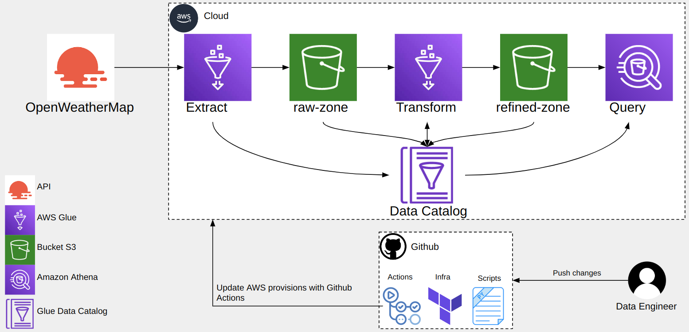

# XPE - MBA Engenharia de Dados

## Projeto Aplicado

### Pipeline de processamento de dados em Batch Serverless com Glue e Athena

#### Código do Projeto Aplicado do MBA Engenharia de Dados Cloud do XPE.

##### Introdução

O projeto consiste em fazer a ingestão de dados de temperatura na API da [openweather](https://openweathermap.org/api), processá-los e disponibilizá-los no Data Lake para consulta no Athena.

Este projeto é provisionado na Cloud Provider AWS. Utilizamos como datalake o S3. 
Para realizar o ETL de dados, utilizamos o AWS GLUE. No Glue temos 2 jobs, um de extração e outro de transformação.

Após os dados serem extraídos, processados e transformados. Eles estão prontos para serem consultados graças ao Glue Data Catalog, então, para a etapa de consulta dos dados (Análise dos dados via SQL Query), utilizamos o Amazon Athena.

##### Desenho Macro

